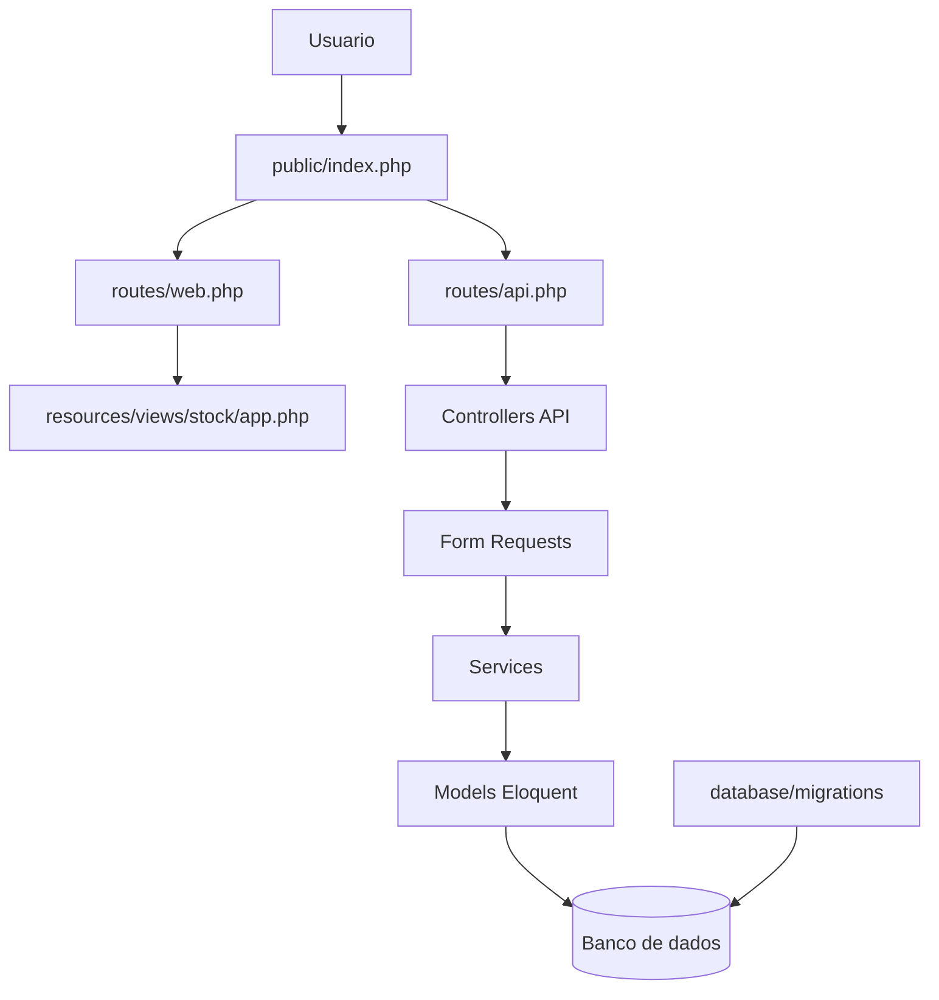

# Arquitetura e fluxo do Controle de Estoque

## Diagnostico do repositório original

O projeto original estava concentrado em cinco arquivos na raiz:

- `index.html`: pagina unica que monta o React via CDN e Babel no navegador.
- `app.js`: copia de referencia do mesmo codigo JSX que estava inline no HTML.
- `style.css`: copia de referencia dos estilos globais.
- `db.php`: conexao PDO e SQL comentado das tabelas.
- `README.md`: instrucoes do PWA e do banco opcional.

Isso funciona para prototipo/PWA local, mas mistura interface, regras de negocio, persistencia, autenticacao e banco no mesmo nivel. A separacao Laravel criada neste commit organiza essas responsabilidades em camadas.

## Fluxo funcional atual

```text
Usuario
  -> App PWA React
      -> Auth local no navegador
      -> Dashboard
      -> Fornecedores
      -> Produtos
      -> Movimentacoes
      -> Notas fiscais mock
      -> Relatorios e alertas
      -> localStorage
```

## Fluxo proposto com Laravel

```text
Usuario
  -> public/index.php
      -> routes/web.php
          -> resources/views/stock/app.php
      -> routes/api.php
          -> Controllers API
              -> Form Requests
              -> Services
              -> Models Eloquent
              -> Migrations / Banco
```



## Responsabilidades por pasta

- `public/`: front controller Laravel, manifesto PWA, service worker e icone publico.
- `resources/views/stock/app.php`: tela legada React/Babel servida pelo Laravel.
- `resources/js/legacy-app.js`: referencia do codigo JS legado para futura migracao para Vite/React.
- `resources/css/legacy-style.css`: referencia dos estilos globais legados.
- `routes/web.php`: rotas que entregam paginas.
- `routes/api.php`: endpoints JSON do backend.
- `app/Http/Controllers/Api`: entrada HTTP de cada modulo.
- `app/Http/Requests`: validacao de payloads antes das regras de negocio.
- `app/Services`: regras que nao pertencem ao controller, como baixa de estoque e emissao/cancelamento mock de NF-e.
- `app/Models`: entidades Eloquent e relacionamentos.
- `database/migrations`: versao Laravel do schema que antes estava comentado no `db.php`.
- `docs/legacy/db.php`: arquivo PDO antigo preservado apenas como referencia historica.

## Separacao por modulo

### Fornecedores

- Controller: `FornecedorController`
- Request: `FornecedorRequest`
- Model: `Fornecedor`
- Migration: `create_fornecedores_table`

Responsabilidade: cadastro e consulta de fornecedores. Produtos se relacionam com fornecedores por `fornecedor_id`.

### Produtos

- Controller: `ProdutoController`
- Request: `ProdutoRequest`
- Model: `Produto`
- Service auxiliar: `EstoqueService::registrarPrecoInicial`

Responsabilidade: cadastro do catalogo, precos, estoque minimo/maximo e alertas por coluna.

### Movimentacoes

- Controller: `MovimentacaoController`
- Request: `MovimentacaoRequest`
- Model: `Movimentacao`
- Service: `EstoqueService::registrarMovimentacao`

Responsabilidade: registrar entrada/saida e atualizar estoque dentro de transacao. Saida com estoque insuficiente retorna erro de validacao.

### Notas fiscais

- Controller: `NotaFiscalController`
- Requests: `StoreNotaFiscalRequest`, `CancelNotaFiscalRequest`
- Models: `NotaFiscal`, `NfItem`
- Service: `NotaFiscalService`

Responsabilidade: manter o mock de emissao/cancelamento fora do controller. Uma integracao real com Focus NFe entraria nesse service.

### Dashboard, relatorios e alertas

- Controller: `DashboardController`
- Models: `Produto`, `Fornecedor`, `Movimentacao`

Responsabilidade: agregacoes de leitura. Relatorios mais complexos podem virar services ou query objects depois.

## Proximos passos recomendados

1. Instalar PHP 8.3+ e Composer.
2. Rodar `composer install`.
3. Copiar `.env.example` para `.env` e configurar o banco.
4. Rodar `php artisan key:generate`.
5. Rodar `php artisan migrate --seed`.
6. Migrar o frontend de `localStorage` para chamadas `fetch('/api/...')`.
7. Trocar o React/Babel via CDN por Vite quando a UI for separada de verdade.
